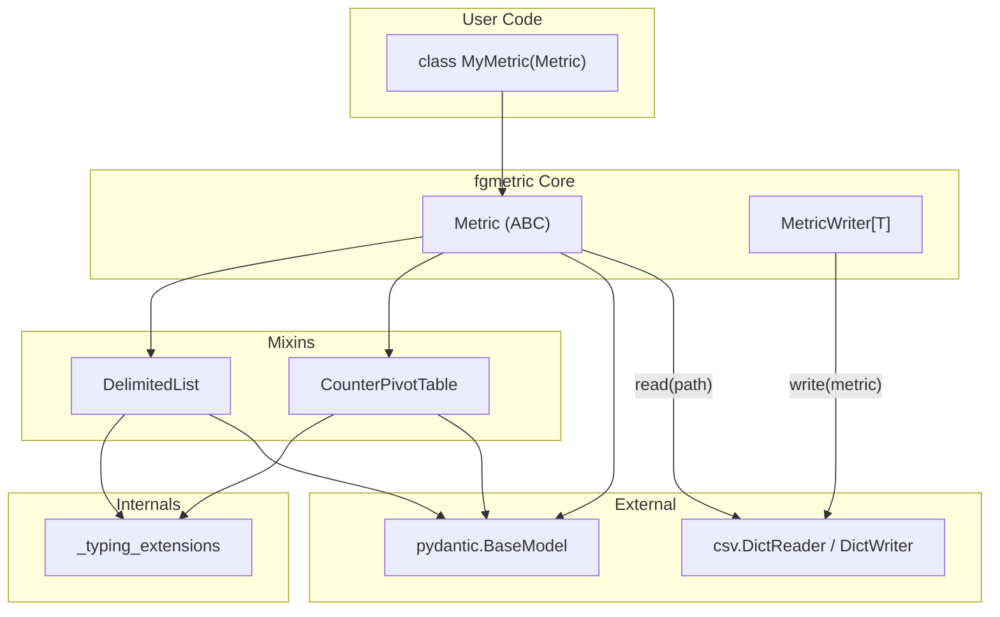

# Expert Software Review: fgmetric

## Executive Summary

This review covers `fgmetric`, a Python library (v0.1.0) by Fulcrum Genomics that provides type-validated Pydantic-backed models for reading and writing delimited data files (TSV, CSV). The library targets bioinformaticians and data engineers who process structured metric files and want type-safe parsing without boilerplate. It replaces manual `csv.DictReader` + type coercion with declarative Pydantic models that handle parsing, validation, and serialization automatically.

The codebase is well-architected, clean, and follows strong Python engineering practices. It uses a mixin-based design to compose features (delimited list support, Counter pivot tables) into the core `Metric` class. The code is thoroughly type-annotated with strict mypy enforcement, well-documented with Google-style docstrings, and includes a solid test suite covering happy paths, error cases, and edge conditions. CI/CD is well-configured with multi-version testing and an automated PyPI publish pipeline.

Key areas of concern are minor: the test suite for `MetricWriter` is thin (only one test), there is no CHANGELOG file yet (though git-cliff is configured for releases), and some stale local branches remain that could be cleaned up. The library documents a known limitation around lossy roundtrips for list elements containing the delimiter character. Overall, this is a high-quality, focused library suitable for production use.

## Quick Reference

| Section | Status | Summary |
| :------ | :----: | :------ |
| [Implementation vs Requirements](#implementation-as-compared-to-functional-requirements) | PASS | All documented features implemented and tested |
| [Software Correctness](#software-correctness) | PASS | Core logic sound, Pydantic handles heavy lifting |
| [Edge Cases and Undefined Behavior](#edge-cases-and-undefined-behavior) | CONCERN | MetricWriter file leak on init error; lossy list roundtrips |
| [Data Transfer and IO](#data-transfer-and-io-dataflow) | PASS | Lazy/streaming reads, good benchmarks |
| [Tool Choices](#tool-choices) | PASS | Minimal, modern dependencies |
| [Parallelism](#parallelism) | PASS | Not needed for use case |
| [Software Security](#software-security) | PASS | Minimal attack surface, pinned GHA SHAs |
| [Software Usability](#software-usability) | PASS | Excellent README, ergonomic API, py.typed marker |
| [Software Durability](#software-durability) | CONCERN | No CHANGELOG.md file exists |
| [Software Portability](#software-portability) | PASS | OS-independent, pure Python |
| [Change Management](#change-management-eg-gitflow) | PASS | Clean commit history, conventional prefixes |
| [Testing for Correctness](#testing-for-software-correctness) | CONCERN | MetricWriter has only 1 test; missing roundtrip tests |
| [Software Deploy and Release](#software-deploy-and-release) | PASS | Comprehensive staged publish pipeline |
| [Language Best Practices](#language-best-practices-and-anti-patterns) | PASS | Strict typing, clean Pydantic usage, no anti-patterns |

## Full Review

| Client: | Fulcrum Genomics |
| :---- | :---- |
| Task: | fgmetric |
| Date: | 2026-02-17 |
| Revision: | 1 |

### Goals and Guidelines

* The software will be described and the software's dataflow will be summarized
* Opportunities for increasing the efficiency or turnaround time of the software will be identified
* Opportunities for improving the quality of the results of the software will be identified
* The estimated impact for each opportunity to improve the software will be estimated

### Review Summary

| Result of Functional Review | Result of Non-Functional Review |
| :---- | :---- |
| Some areas for improvement or low risks identified | Some areas for improvement or low risks identified |

### System Overview

#### System Architecture

`fgmetric` is a pure Python library with a single runtime dependency (Pydantic >=2.11.4). It provides two primary public classes -- `Metric` and `MetricWriter` -- for reading from and writing to delimited text files.

The architecture uses a mixin-based composition pattern. The `Metric` class inherits from:

1. **`DelimitedList`** -- A Pydantic `BaseModel` mixin that adds automatic splitting/joining of `list[T]` fields from/to delimited strings.
2. **`CounterPivotTable`** -- A Pydantic `BaseModel` mixin that supports pivot-table-style serialization of `Counter[StrEnum]` fields.
3. **`BaseModel`** (Pydantic) -- Provides the core validation, type coercion, and serialization engine.
4. **`ABC`** -- Marks `Metric` as abstract; users must subclass it.

A private `_typing_extensions` module provides runtime type introspection utilities (`is_optional`, `is_list`, `is_counter`, etc.) used by the mixins to discover and process annotated fields.

**Dataflow (read):** File on disk --> `csv.DictReader` parses each row to `dict[str, str]` --> Pydantic model validators (CounterPivotTable collects columns, Metric converts empty strings to None) --> Pydantic field validators (DelimitedList splits list fields) --> Pydantic type coercion --> validated `Metric` instance yielded to caller.

**Dataflow (write):** `Metric` instance --> `model_dump()` triggers serializers (DelimitedList joins lists, CounterPivotTable pivots Counter) --> `csv.DictWriter` writes row to file.

#### System Inputs & Outputs

The inputs to the software are:

| Parameter Name | Type | Parameter Description |
| :---- | :---- | :---- |
| `path` | `Path` | Path to a delimited text file (TSV, CSV, etc.) to read. |
| `delimiter` | `str` | Column delimiter character. Defaults to `"\t"` (tab). |
| `metric_class` | `type[T]` | A user-defined `Metric` subclass that declares the expected columns and types. |
| `filename` | `Path \| str` | Path to a file to write metrics to (MetricWriter). |
| `lineterminator` | `str` | Line terminator for MetricWriter output. Defaults to `"\n"`. |

The outputs of the software include:

| Tool | Output file | Type |
| :---- | :---- | :---- |
| `Metric.read()` | N/A (iterator) | `Iterator[T]` -- lazy stream of validated metric instances |
| `MetricWriter.write()` | User-specified path | Delimited text file with header row and metric data rows |

### Functional Review of the Software

#### Implementation as Compared to Functional Requirements

**Status: PASS**

**Evidence:** The README (`README.md:12-167`) documents the following features:
1. Define Python classes that map to rows in CSV/TSV -- implemented in `fgmetric/metric.py:19-131`
2. Automatic type coercion (string to int, float, bool) -- provided by Pydantic integration, tested in `tests/test_metric.py:125-155`
3. Custom delimiters -- `delimiter` parameter on `read()` (`metric.py:62`) and `MetricWriter.__init__()` (`metric_writer.py:48-54`)
4. List fields parsed from/to delimited strings -- implemented in `fgmetric/collections/_delimited_list.py`, tested in `tests/test_collections.py:14-165`
5. Counter fields with pivot table representation -- implemented in `fgmetric/collections/_counter_pivot_table.py`, tested in `tests/test_collections.py:168-281`
6. Empty value handling (empty string -> None for Optional fields) -- `metric.py:77-94`, tested in `tests/test_metric.py:163-190`

**Explanation:** All documented features are implemented and tested. The README examples are accurate and match the actual API signatures. The comparison section (vs. csv+dataclasses, vs. pandas, vs. Pydantic alone) accurately describes the library's differentiators. No discrepancies found between documented and actual behavior.

#### Software Correctness

**Status: PASS**

**Evidence:**
- Type coercion correctness is delegated to Pydantic, a widely-used and battle-tested validation library (`metric.py:67`: `cls.model_validate(record)`).
- The empty-field-to-None validator (`metric.py:77-94`) correctly checks `is_optional()` before converting, preventing data loss on required fields.
- The DelimitedList mixin correctly handles the string-splitting lifecycle: empty string -> empty list (`_delimited_list.py:121`), populated string -> split list (`_delimited_list.py:114`), and optional None elements (`_delimited_list.py:117-118`).
- The CounterPivotTable validator (`_counter_pivot_table.py:120-164`) correctly copies the input dict to avoid mutation (`line 127`), handles the case where a Counter dict is already provided (`lines 133-137`), and initializes missing enum members to zero (`line 141`).
- UTF-8 BOM handling is implemented with `encoding="utf-8-sig"` (`metric.py:65`).

**Explanation:** The core logic is sound. Pydantic handles the heavy lifting of type coercion and validation. The custom validators are well-ordered (model validators run before field validators) and handle edge cases carefully. The code includes defensive copies where needed (e.g., `data = dict(data)` in `_collect_counter_values`).

#### Edge Cases and Undefined Behavior

**Status: CONCERN**

**Evidence:**
1. **Lossy list roundtrips:** Documented in `_delimited_list.py:39-41` -- `["a,b", "c"]` serializes to `"a,b,c"` and deserializes to `["a", "b", "c"]`. This is a known limitation, documented but not guarded against.
2. **MetricWriter file leak on init error:** In `metric_writer.py:65`, the file is opened before the `DictWriter` is constructed (`line 67-72`). If `DictWriter` or `writeheader()` raises, `_fout` is open but never closed (no try/finally).
3. **MetricWriter used outside context manager:** If a user calls `MetricWriter(...)` without `with`, the file is opened immediately and the header is written, but there is no guarantee `close()` will be called. The docstring warns about this (`metric_writer.py:41-42`), but it could lead to resource leaks.
4. **Empty file (no header):** Reading a completely empty file (no header, no rows) would cause `DictReader` to produce no rows, which is silently correct. However, this is not tested.
5. **Counter field name collision:** If a model has both a regular field and a Counter enum member with the same string value, the `_collect_counter_values` validator skips fields that exist in `model_fields` (`_counter_pivot_table.py:147-148`). This is correct behavior but could be confusing.

**Recommendation:**
- **Medium impact:** Add a try/except in `MetricWriter.__init__` to close the file handle if `DictWriter` construction or `writeheader()` fails.
- **Low impact:** Add a test for reading a completely empty file (no header row).
- **Low impact:** Consider adding a warning or validation if a list element contains the `collection_delimiter`, since the roundtrip will be lossy.

### Non-Functional Review of the Software

#### Performance and Scalability

##### Data Transfer and IO (Dataflow)

**Status: PASS**

**Evidence:**
- `Metric.read()` returns an iterator/generator (`metric.py:62-67`), enabling lazy evaluation and streaming of large files without loading all rows into memory.
- Files are opened with `with` statements during reading (`metric.py:65-67`).
- The benchmark results (`docs/benchmarks.md`) show ~5x performance improvement over fgpyo's reflection-based approach (50ms vs 275ms for 10K rows; 564ms vs 2,775ms for 100K rows).

**Explanation:** The streaming architecture is a deliberate design choice documented in the README ("unlike pandas, `fgmetric` processes records lazily -- you can handle files larger than memory"). File I/O uses standard Python `csv` module facilities, which are well-optimized.

##### Tool Choices

**Status: PASS**

**Evidence:**
- **Pydantic >=2.11.4** (`pyproject.toml:14`): Best-in-class Python validation library with Rust-accelerated core. Version floor is recent and actively maintained.
- **Python's `csv` module**: Standard library, well-tested, appropriate for the task.
- **hatchling** (`pyproject.toml:2`): Modern, standards-compliant build backend.
- **Development tools**: ruff 0.14.4 (linter/formatter), mypy 1.18.2 (type checker), pytest ~8.3 -- all current, actively maintained tools.

**Explanation:** Tool choices are excellent. The minimal dependency footprint (only Pydantic at runtime) is a strength. Development tooling is modern and well-configured.

##### Parallelism

**Status: PASS**

**Evidence:** The library processes files sequentially, one row at a time (`metric.py:66-67`). There is no parallelism.

**Explanation:** Parallelism is not needed for this library's use case. Parsing delimited files is inherently sequential (row-by-row) and I/O-bound. The library's performance (~500ms for 100K rows) is more than sufficient for its intended use. Consumers who need to process multiple files concurrently can do so at the application layer.

#### Other Software Qualities and Attributes

##### Software Security

**Status: PASS**

**Evidence:**
- No network calls, subprocess invocations, or credential handling.
- No dynamic code execution (eval, exec).
- No deserialization of arbitrary objects (Pydantic validates to declared types).
- File operations are limited to reading and writing at user-specified paths -- no path manipulation or traversal.
- The publish workflow uses Trusted Publishing (OIDC) with no stored secrets (`publish.yml:69-71`).
- GitHub Actions are pinned to commit SHAs (`python_package.yml:18`, `publish.yml:28`).

**Explanation:** The library has a minimal attack surface. It reads and writes delimited text files using standard library facilities and validates all data through Pydantic's type system. No security concerns identified.

##### Software Usability

**Status: PASS**

**Evidence:**
- **README** (`README.md`): Clear overview, installation instructions for both pip and uv, motivation section ("Why fgmetric?"), comparison to alternatives, quick start with runnable examples, detailed core usage guide.
- **CONTRIBUTING.md**: Development setup in 2 commands (`uv sync --locked` + `pre-commit install`), individual commands for each check type, task runner shortcuts.
- **API ergonomics**: Reading is one line (`for m in MyMetric.read(path)`), writing uses a context manager. Sensible defaults (tab delimiter, comma list separator).
- **Error messages**: Pydantic provides detailed `ValidationError` messages including field name and error description.
- **Type stubs**: `py.typed` marker file present (`fgmetric/py.typed`), enabling IDE autocompletion and type checking for consumers.

**Explanation:** The library is well-documented and ergonomic. The README covers all essential use cases with examples. The `py.typed` marker enables first-class IDE support. Error messages from Pydantic are detailed and actionable.

##### Software Durability

**Status: CONCERN**

**Evidence:**
1. **No CHANGELOG:** There is no `CHANGELOG.md` file in the repository, despite the publish workflow generating changelogs with git-cliff (`publish.yml:125-145`). The CLAUDE.md mentions updating CHANGELOG.md but the file doesn't exist yet.
2. **Dependency pinning:** Runtime dependency uses floor pin (`pydantic>=2.11.4`), which is appropriate for a library. Dev dependencies use compatible-release pins (`~=`), and the lock file (`uv.lock`) ensures reproducible dev environments. The `check-lock` task verifies lock freshness.
3. **Version:** The project is at `0.1.0` ("Alpha" status per `pyproject.toml:17`), so pre-1.0 breaking changes are expected and acceptable.

**Recommendation:**
- **Low impact:** Create an initial `CHANGELOG.md` to track user-facing changes, even if just a stub referencing the GitHub releases page. This aligns with the project's own CLAUDE.md guidelines.

##### Software Portability

**Status: PASS**

**Evidence:**
- `pyproject.toml:26`: `"Operating System :: OS Independent"` classifier.
- No OS-specific code: no hardcoded paths, no platform-dependent imports, no subprocess calls.
- CI tests on `ubuntu-latest` (`python_package.yml:12`). Only tested on one OS.
- Standard library file I/O with `pathlib.Path` throughout.
- `.python-version` specifies 3.12, but `pyproject.toml` declares `>=3.12` and CI tests 3.12 + 3.13.

**Explanation:** The library is OS-independent by design. Pure Python with standard library I/O means it should work on any platform with Python 3.12+. Testing on macOS or Windows in CI would increase confidence but is not critical for a library of this nature.

#### DevOps and CI/CD

##### Change Management (*e.g.* Gitflow)

**Status: PASS**

**Evidence:**
- **Branch strategy:** Single `main` branch as the primary branch. Feature branches follow `ms_<description>` naming convention. PRs are merged into main (commit messages reference PR numbers: `(#14)`, `(#13)`, etc.).
- **Commit messages:** Follow conventional commit format with type prefixes (`feat:`, `doc:`, `build:`, `chore:`, `refactor:`). Messages are concise and descriptive.
- **Commit granularity:** Each commit represents a logical unit of work (e.g., `feat: CounterPivotTable (#3)`, `feat: Delimited lists (#1)`).
- **CODEOWNERS:** `@msto` owns all files (`.github/CODEOWNERS`).
- **Single contributor:** 89 commits from Matt Stone. All development through PRs with merge commits.
- **Stale branches:** ~20 local branches remain from merged PRs. Only 5 remote branches exist.

**Recommendation:**
- **Low impact:** Clean up stale local branches (`ms_update-readme`, `ms_base-metric`, etc.) that have been merged.

##### Testing for Software Correctness

**Status: CONCERN**

**Evidence:**
- **Test framework:** pytest ~8.3 with pytest-cov for coverage.
- **Test breadth:** Tests exist for all public modules:
  - `test_metric.py`: 21 tests covering basic reading, type coercion, empty field handling, BOM handling, field aliases, edge cases, validation errors, and parent/subclass behavior.
  - `test_metric_writer.py`: 1 test covering basic write and header generation.
  - `test_collections.py`: 10 tests covering delimited lists (comma, custom delimiters, complex types, optional fields, optional elements) and Counter pivot tables (read/write, missing members, error conditions).
  - `test_typing_extensions.py`: 10 parametrized test functions covering `is_optional`, `unpack_optional`, `is_list`, `has_origin`, `has_optional_elements`.
- **Test types:** Unit tests only. No integration or end-to-end tests (though the read/write roundtrip tests in `test_collections.py` serve as lightweight integration tests).
- **CI integration:** Tests run on every push via `uv run poe check-all` (`python_package.yml:33`), across Python 3.12 and 3.13.
- **Coverage:** `pytest-cov` is configured (`pyproject.toml:129`), benchmarks excluded from coverage.

**Gaps identified:**
1. `MetricWriter` has only 1 test. Missing tests for: writing with custom delimiters, writing with field aliases, error handling (writing wrong metric type), close behavior, context manager exception handling.
2. No test for `MetricWriter.writeall()` specifically (only `write()` is tested individually).
3. No test for reading/writing a complete roundtrip at the `Metric` level (read -> write -> read should produce identical results).
4. No test for `Metric._header_fieldnames()` directly, particularly the Counter field name expansion path.

**Recommendation:**
- **Medium impact:** Expand `test_metric_writer.py` to cover custom delimiters, writeall, field aliases, and error paths. A roundtrip test (write metrics -> read them back -> assert equality) would significantly increase confidence.

##### Software Deploy and Release

**Status: PASS**

**Evidence:**
- **Versioning:** `0.1.0` in `pyproject.toml:7`. Semver-like tag format (`[0-9]+.[0-9]+.[0-9]+` per `publish.yml:6`). One tag exists: `0.1.0`.
- **Release automation:** The `publish.yml` workflow handles the complete release pipeline: tests -> build -> TestPyPI -> PyPI -> changelog -> GitHub release.
- **Distribution artifacts:** Both sdist and wheel built (`publish.yml:42`), verified with twine (`publish.yml:50`).
- **Security:** Trusted Publishing (OIDC) for both TestPyPI and PyPI. No stored API tokens. GitHub Actions pinned to SHAs with version comments.
- **Concurrency control:** `concurrency` group prevents duplicate publishes (`publish.yml:9-11`).

**Explanation:** The release pipeline is comprehensive and follows best practices. The staged approach (test -> TestPyPI -> PyPI) with optional manual approval provides a safety net. Generating changelogs and GitHub releases automatically reduces manual effort and ensures consistency.

#### Language Best Practices and Anti-Patterns

**Status: PASS**

**Evidence:**

**Type annotations:**
- Full type annotations on all function parameters and return types across the entire codebase.
- Strict mypy configuration with 14 strictness flags enabled (`pyproject.toml:90-110`), including `disallow_untyped_defs`, `strict_optional`, `warn_unreachable`, and `exhaustive-match`.
- `TypeVar` used appropriately for generic `Metric.read()` (`metric.py:16`).
- PEP 695 generic syntax used for `MetricWriter[T: Metric]` (`metric_writer.py:12`).
- `ClassVar` annotations on mixin class variables (`_delimited_list.py:74-76`, `_counter_pivot_table.py:40-41`).

**Pydantic usage:**
- Correct use of `model_validator(mode="before")` for pre-processing (`metric.py:77`, `_counter_pivot_table.py:118`).
- Correct use of `field_validator("*", mode="before")` for field-level pre-processing (`_delimited_list.py:108`).
- `@final` decorators on mixin methods to prevent accidental override (`_delimited_list.py:107,125,150`, `_counter_pivot_table.py:117,166`).
- `__pydantic_init_subclass__` hook used for class-level validation at definition time.

**Code style:**
- Ruff configured with comprehensive lint rules including docstring checks, naming conventions, bug detection (`pyproject.toml:141-161`).
- Google-style docstrings on all public classes and methods.
- Consistent use of `pathlib.Path` instead of `os.path`.
- Context managers for file handling.
- No commented-out code, no dead code, no `Any` without justification (except in Pydantic validator signatures where required).

**Patterns:**
- Clean separation of concerns via mixins.
- `ABC` prevents direct instantiation of `Metric`.
- Private naming convention (`_typing_extensions`, `_delimited_list`, `_counter_pivot_table`) for internal modules.
- No anti-patterns observed: no god classes, no deep inheritance, no mutable default arguments.

**Minor observations (not defects):**
- `metric.py:4` imports `Any` from `typing`, used only in the `_empty_field_to_none` validator signature -- this is a Pydantic requirement, not a code smell.
- `_counter_pivot_table.py:87` has a `# noqa: C901` for complexity on `_get_counter_enum`, which is reasonable given the method's validation logic.

## Next Steps

See drafted issues in `agent_notes/issues/` for actionable items from this review.
